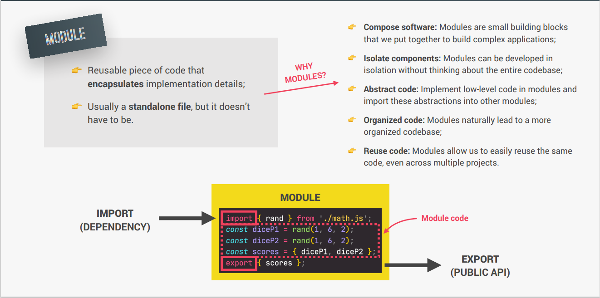
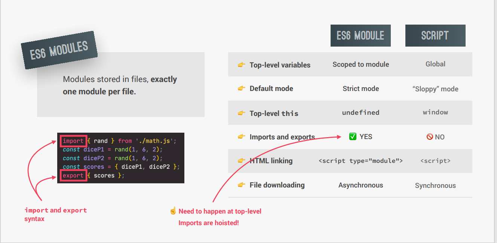
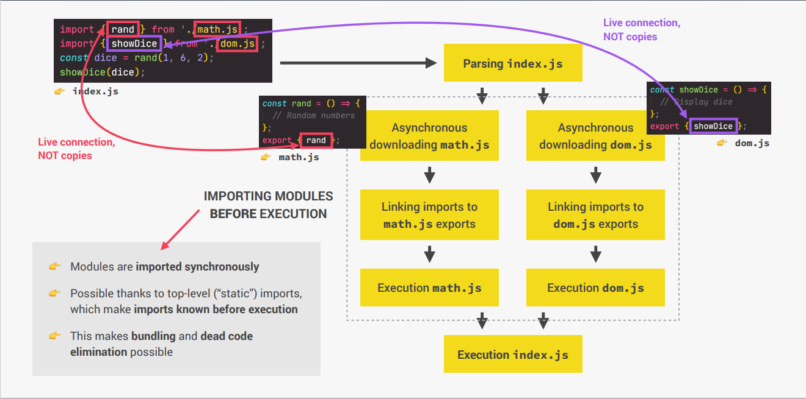
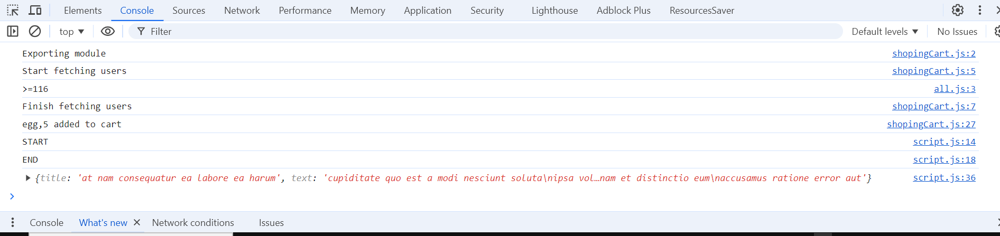
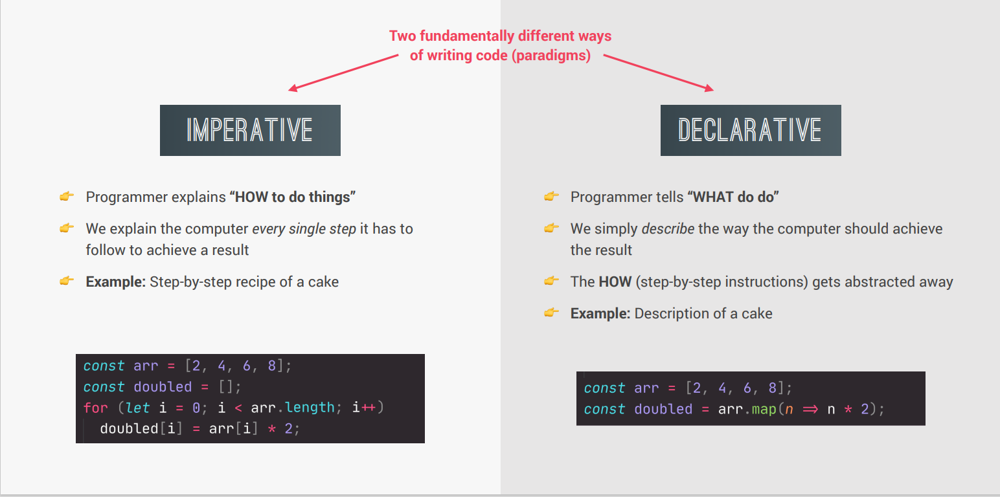
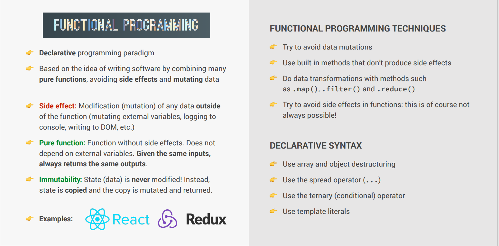

# Modules,Tooling and Functional

# orange cat  aivave title/heading likhe
## aiave sub heading
### hello aiave aro heading lekha jai
#### etc etc

1. number aivave likhe
2. number 2

- aiave dash dile doy hoiye jai.
- hi ami dot
- _sadia pocha_ aiave under dash dile italick hoi
- **hi,sadia** aiave double star dile bold hoi

akon pic add korbo

aiave pic add kore
akon git a push kore dekbo readme kmn hoi . terminal open kore git push korbo
terminal open korte ctrl + ` dibo


## Modules

- In programming, a module is a self-contained piece of code that represents a single unit of functionality
- A **live connection** allows you to update a module's content while it's being used, without reloading the application.



## ES6 Modules vs Script



### One file per module

- In JavaScript, "one module per file" means:

1. Each file has its own separate code
2. Each file exports one main thing (like a function or class)
3. Other files can import and use that thing

- It helps keep code organized and easy to use.

## How Es6 module are Imported



## Namespace in JS Module

- A way to organize and scope variables, functions, and classes
- An object that contains all the exports of a module
- Used to avoid naming conflicts and improve code readability

### Exporting

- After the module's code is executed, the module's exports (like functions or variables) are made available to the script that imported it.
- Export always need to happen at **top level** of the code
- Example : it will give use an error

```js
if (true) {
  export const addToCart = function (product, quantity) {
    cart.push({ product, quantity });
    console.log(`${product},${quantity} added to cart`);
  };
}
```

- In JavaScript modules, **named exports** are exports that are explicitly named when exported from a module.
- we can change name while exporting

```js
export { totalPrice, totalQuantity as tq };
```

- A default export is a single value that is exported from a module without being explicitly named.If I try to export multiple values as default, i will get a syntax error.

```js
export default function (product, quantity) {
  console.log(`${product},${quantity} added to cart`);
}
```

- We should not use named and default value together. It creates complexity.

### Importing

- The interpreter looks for the module you want to import. If it finds it, it starts executing the code inside the module.
- we can change name while importing

```js
import { addToCart, totalPrice as price, tq } from './shopingCart.js';
```

- We can import everything from a module

```js
import * as ShoppingCart from './shopingCart.js';
ShoppingCart.addToCart('bread', 5);
```

- Here we are importing everything in a namespace object called ShoppingCart This allows me to access all the exports of the module through the ShoppingCart object.

- When importing a module with a default export, I can choose any name I want

```js
import add from './shopingCart.js';
add('egg', 5);
```

## Top level await

[note]: **Use 3G in network mode**

- After ES2022 we can use await in module **without async function** and that is called top level await.
- We can not use top level await in normal **script** . It has to be module.
- Example:

```js
console.log('START');
const res = await fetch('https://jsonplaceholder.typicode.com/posts');
const data = await res.json();
console.log(data);
console.log('END');
```

- Here you can see that we can use await without async function
- We have to be **cautious** because top level await has **code blocking behavior**. If we use the example we can see that first console will be **START** second **Data** and third **END**. It proves that top level await is code blocking.
- If we import a **module which has top level await** we will face a problem.It will **block** the execution of code after it . And it will execute the next code after finishing execution of top level await.
- Example:

```js
// Module1 / Export / blocking code

console.log('Start fetching users');
await fetch('https://jsonplaceholder.typicode.com/users');
console.log('Finish fetching users');

// Module2 / Import

import add from './shopingCart.js';
add('egg', 5);

console.log('START');
const res = await fetch('https://jsonplaceholder.typicode.com/posts');
const data = await res.json();
// console.log(data);
console.log('END');
```

- Look at the console
  
- You will see that after finishing the execution of blocking code it will execute the code in **module1**

### Real world use of top level await

```js
const getPost = async function (p) {
  const res = await fetch('https://jsonplaceholder.typicode.com/posts');
  const data = await res.json();

  return { title: data.at(-1).title, text: data.at(-1).body };
};

const lastPost = getPost();

// Not very clean
// const lastPost2 = lastPost.then(post => console.log(post))

// The clean way: Top level await
const lastPost2 = await lastPost;
console.log(lastPost2);
```

## The module pattern (before es6 modules)

- We have to create different scripts and link them in order in HTML
- And we can't use a module bundler by default, but we can use tools like RequireJS or other module loaders to help manage dependencies.

```js
// The Module Pattern

const ShoppingCart2 = (function () {
  const cart = [];
  const shippingCost = 10;
  const totalPrice = 237;
  const totalQuantity = 23;

  const addToCart = function (product, quantity) {
    cart.push({ product, quantity });
    console.log(
      `${quantity} ${product} added to cart (sipping cost is ${shippingCost})`
    );
  };

  const orderStock = function (product, quantity) {
    console.log(`${quantity} ${product} ordered from supplier`);
  };

  return {
    addToCart,
    cart,
    totalPrice,
    totalQuantity,
  };
})();

ShoppingCart2.addToCart('apple', 4);
ShoppingCart2.addToCart('pizza', 2);
console.log(ShoppingCart2);
console.log(ShoppingCart2.shippingCost);
```

## CommonJS Modules
- Important for node js and are used by default in Node.js environments.
- Almost all npm repository use CommonJs module
```js
// Export
export.addTocart = function (product, quantity) {
  cart.push({ product, quantity });
  console.log(
    `${quantity} ${product} added to cart (sipping cost is ${shippingCost})`
  );
};

// Import
const { addTocart } = require('./shoppingCart.js');

```
## Basic CommandLine

**Navigation**

* `Get-ChildItem` (or `gci` or `dir` or `ls`): Displays a list of files and folders in the current directory.
* `Set-Location` (or `cd` or `chdir`): Changes the current directory.
	+ Example: `cd Documents` (moves to the Documents folder)
	+ Example: `cd ..` (moves to the parent directory)
	+ Example: `cd ~` (moves to the user's home directory)
  * `cd` with up and down:
	+ `cd ..` (moves up one directory level)
	+ `cd ../../` (moves up two directory levels)
	+ `cd ./` (stays in the current directory)
	+ `cd ./subfolder` (moves down into the subfolder)

**Creating and Deleting**

* `New-Item` (or `ni`): Creates a new item (file or folder).
	+ Example: `ni MyFolder` (creates a new folder named MyFolder)
* `Remove-Item` (or `rm` or `del` or `erase`): Deletes a file or folder.
	+ Example: `rm myfile.txt` (deletes the file myfile.txt)
	+ Example: `rm MyFolder` (deletes the folder MyFolder)

**Renaming and Editing**

* `Rename-Item` (or `ren`): Renames a file or folder.
	+ Example: `ren myfile.txt mynewfile.txt` (renames myfile.txt to mynewfile.txt)
* `Invoke-Item` (or `ii`): Opens a file in the default editor.
	+ Example: `ii myfile.txt` (opens myfile.txt in the default editor)

**Note**: Some commands have aliases, which are shorter versions of the command. The following aliases are used in the examples above:
  + `gci`: `Get-ChildItem`
	+ `cd`: `Set-Location`
	+ `rm`: `Remove-Item`
	+ `ren`: `Rename-Item`
	+ `ii`: `Invoke-Item`
	+ `dir`: `Get-ChildItem` (same as `gci`)
	+ `ls`: `Get-ChildItem` (same as `gci`)
	+ `chdir`: `Set-Location` (same as `cd`)
	+ `del`: `Remove-Item` (same as `rm`)
	+ `erase`: `Remove-Item` (same as `rm`)

  ## Modern and clean code
  
  

  ## Imperative VS Declarative code
  
  ### Functional programing princples
  

**_For more NOTES visit my github [https://github.com/Touhidujjaman-Emon]_**

<!--
  Copyright 2024 [Touhidujjaman Emon]
  Do not remove this notice.
  For more NOTES visit my github [https://github.com/Touhidujjaman-Emon]
-->
