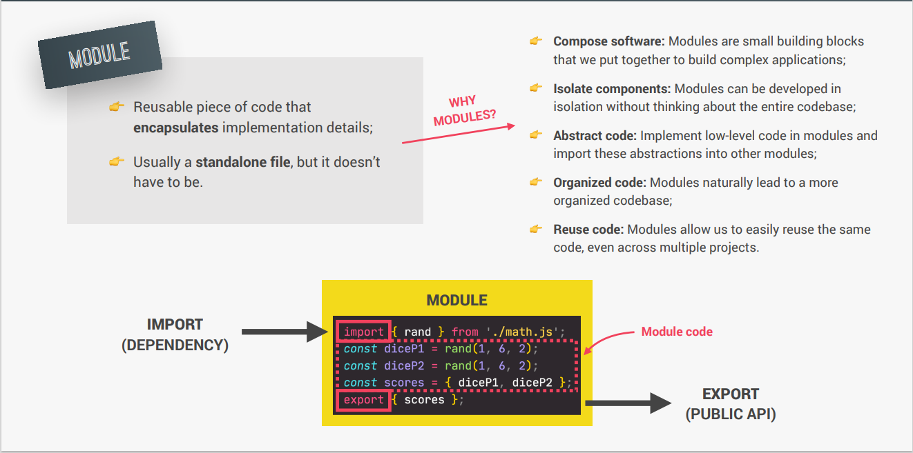

# Modules,Tooling and Functional

## Modules
- In programming, a module is a self-contained piece of code that represents a single unit of functionality

## ES6 Modules vs Script

## How Es6 module are Imported

- **Importing**: The interpreter looks for the module you want to import. If it finds it, it starts executing the code inside the module.
- **Exporting**: After the module's code is executed, the module's exports (like functions or variables) are made available to the script that imported it.